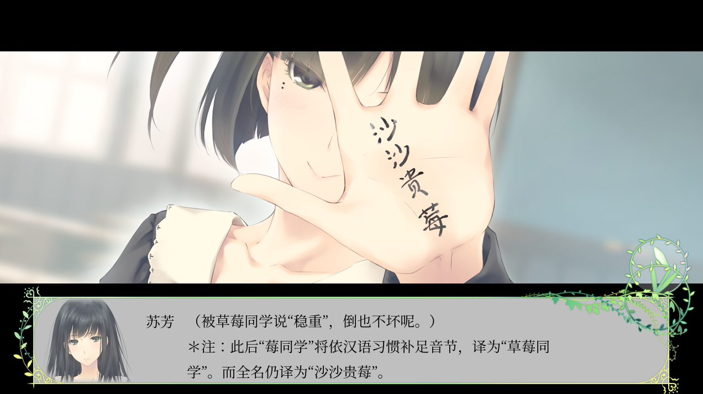

# tsflowers

在浏览器中玩 FLOWERS

# 准备资源

下文中请使用你的游戏名(春 printemps, 夏 ete, 秋 automne, 冬 hiver)

0. 字体(放入 fonts 文件夹; 括号中是 archlinux 包名)
   Noto Serif(noto-fonts-cjk): NotoSerifCJK-Regular.ttc
1. 图片、视频、音频
   1. 将相应 IGA 文件(除 script.iga)解压到 game_printemps 的对应文件夹中
   2. 将视频重新编码为 webm (浏览器不支持原游戏使用的 mpeg)  
      例: `ffmpeg -i op.mpg -c:v libvpx-vp9 -crf 24 -b:v 0 op.webm`
   3. 将 bgm 文件夹内的文件名改为小写
      (原游戏大小写不敏感，脚本中是小写，而文件中是大写；这在 HTTP 中会导致找不到文件；我们统一为小写)
   4. (可选) 压缩为 webp, opus
      1. 运行 make_compress_script.sh 生成 3 个脚本，分别将 png, bmp, ogg 转换为 webp, opus 格式  
         **注意：在运行前请检查脚本内容**
      2. (可选)删除 png, bmp, ogg 文件
      3. 在 index_xxx.html 中将 MyFS 后的 true 改为 false 以使用压缩前的文件名
2. 脚本
   1. 进入 make_script, `npm install iconv-cp932` 安装依赖
   2. 将 script.iga 解压到 make_script/scripts_printemps
   3. 运行 `node main_printemps.js > ../game_printemps/scripts.js` 生成 scripts.js
3. (冬篇)调查位置
   无需操作，如果正确解压，`game_hiver/system`下应有`search01mask.msk`文件

# 准备资源(汉化版)

尝试性地迁移了春篇的 Steam 汉化版

1. 图片、视频、音频
   1. 将相应 IGA 文件(除 script.iga)解压到 game_printemps_cn 的对应文件夹中
   2. 将视频重新编码为 webm (浏览器不支持原游戏使用的 mpeg)  
      例: `ffmpeg -i op.mpg -c:v libvpx-vp9 -crf 24 -b:v 0 op.webm`
      如果之前你做过日文版春篇，也可直接从那边复制，而不用重新编码
   3. 与日文版一样
   4. 与日文版一样
2. 导入汉化版资源
   1. 如果 FLOWERS.exe 比较大，请用 evbunpack 将它解压，得到 data00-data04.iga
   2. 或者这几个 iga 文件就在安装目录下
   3. 将 data01-data03 解压到 game_printemps_cn 的对应文件夹中
   4. 在 game_printemps_cn 中使用 Python3 运行 make_replace_sh.py
   5. 将它的输出重定向到一个 sh 文件中，运行
      (这一步将把加密的文件名还原为原始文件名，并替换对应文件)
3. 脚本
   1. 进入 make_script 文件夹，将 data00.iga 解压到 data00_printemps_cn
   2. 安装依赖 `npm install md5 iconv-lite`
   3. 运行 `node main_printemps_cn.js > ../game_printemps_cn/scripts.js` 生成 scripts.js

# 编译/运行

~~使用 `tsc` 编译 typescript 程序，生成 index.js~~（为方便使用，增加已编译的 js 文件）

使用任意网页服务器提供本文件夹，不要从本地直接打开(由于同源策略，这样没有声音)

例: `python -m http.server` (localhost:8000)

或使用 electron 运行 elmain.js

# 操作

```
X - 快进
A - 开关自动模式[同时点击一次]
Z - 点击一次
S - 存档(写到输入框和剪贴板)
L - 从输入框读档(按S后按L可作为快速存档)
(Electron)
Ctrl-R - 刷新页面
Ctrl-Shift-I - 开发者工具
```

_嗯，存档是即时存档，在对话和选择以外的地方也可以存，我尽力保证加载后是正确的_

# 待实现/已知 BUG

1. 多周目相关  
   目前遇到是否通关的判断时，一律认为已经通关

冬篇调查位置已经实现，可通过测试菜单快速进入  
尝试修复了视频中读档的问题

# 截图


