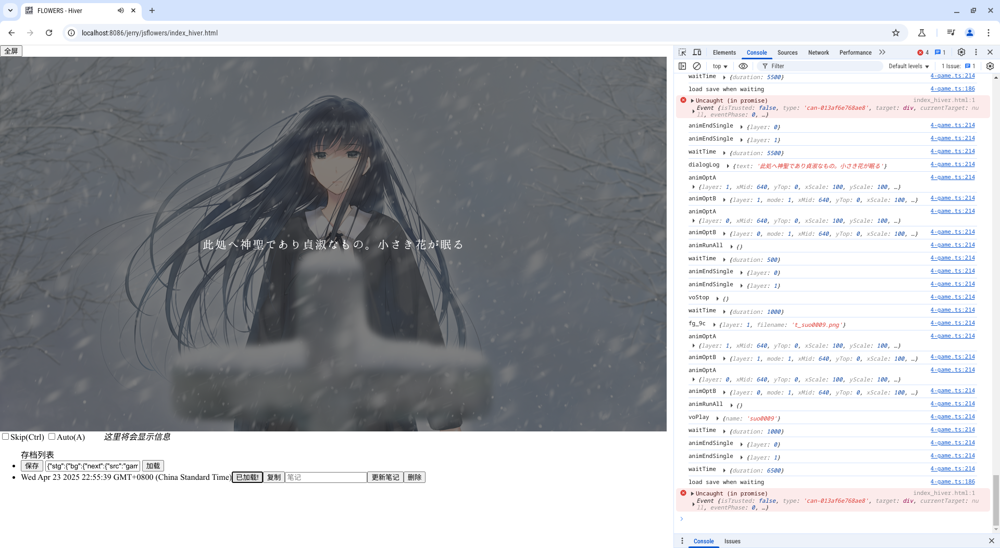
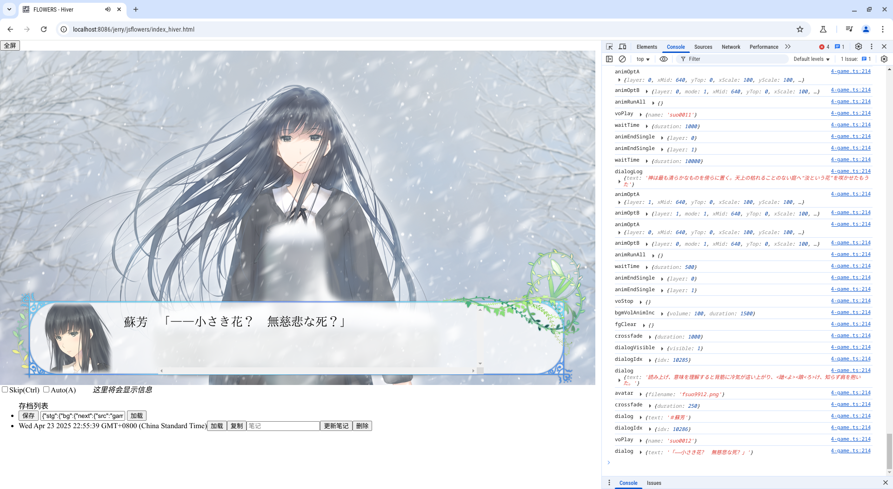
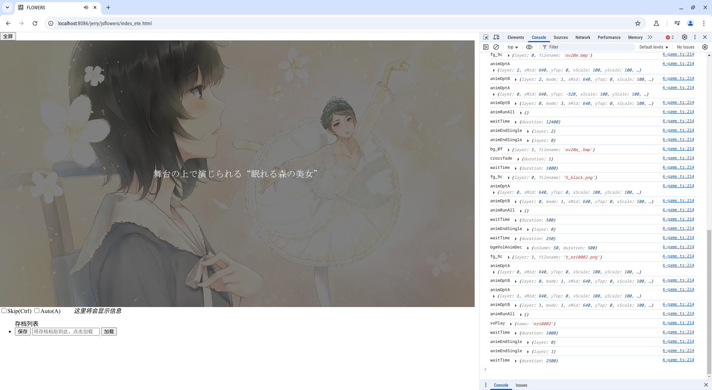
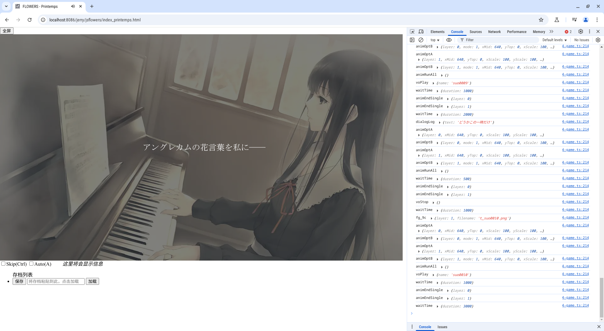

# tsflowers

在浏览器中玩 FLOWERS

# 准备资源

下文中请使用你的游戏名(春 printemps, 夏 ete, 秋 automne, 冬 hiver)  
我没有准备秋的相关脚本，请模仿其他三作自行编写

0. 字体(放入 fonts 文件夹; 括号中是 archlinux 包名)
   1. IPAmj 明朝(otf-ipamjfont): ipamjm.ttf
   2. 梅ゴシック(ttf-ume): ume-pgo4.ttf
1. 图片、视频、音频
   1. 将相应 IGA 文件(除 script.iga)解压到 game_printemps 的对应文件夹中
   2. 将视频重新编码为 webm (浏览器不支持原游戏使用的 mpeg)  
      例: `ffmpeg -i op.mpg -c:v libvpx-vp9 -crf 24 -b:v 0 op.webm`
   3. 将 bgm 文件夹内的文件名改为小写
      (原游戏大小写不敏感，脚本中是小写，而文件中是大写；这在 HTTP 中会导致找不到文件；我们统一为小写)
   4. (可选) 压缩为 webp, opus
      1. 运行 make_compress_script.sh 生成 3 个脚本，分别将 png, bmp, ogg 转换为 webp, opus 格式  
         **注意：在运行前请检查脚本内容**
      2. (可选)删除 png, bmp, ogg 文件
      3. 在 index_xxx.html 中将 MyFS 后的 false 改为 true 以使用压缩后的文件名
2. 脚本
   1. 进入 make_script, `npm install iconv-cp932` 安装依赖
   2. 将 script.iga 解压到 make_script/scripts_printemps
   3. 运行 `node main_printemps.js > ../game_printemps/scripts.js` 生成 scripts.js

# 编译/运行

使用 `tsc` 编译 typescript 程序，生成 index.js

使用任意网页服务器提供本文件夹，不要从本地直接打开(由于同源策略，这样没有声音)

例: `python -m http.server` (localhost:8000)

# 操作

```
Ctrl - 快进
A    - 开关自动模式
Z    - 点击一次
S    - 存档(写到输入框和剪贴板)
L    - 从输入框读档(按S后按L可作为快速存档)
```

_嗯，存档是即时存档，在对话和选择以外的地方也可以存，我尽力保证加载后是正确的_

# 待实现/已知 BUG

1. 冬篇: 调查环节的点击位置  
   (点击系统已经实现，只差写出点击位置)
2. 在播放视频时存档，读取时可能跳过视频，或播放错误的声音  
   (暂时解决方法: 不要在播放视频时存档)

# 截图





